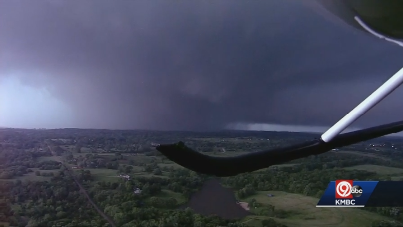

# Tornado Emergency in KC metro

5/28/2019
Finally, this will be my first blog.

It was little bit scary :fearful:. I dropped off my friend at the airport and came back home at around 6 or 7 pm today. On my way back, I got a crazy tornado emergency alert from my phone. (I was not serious on this alert, though). But I got off from the highway, sirens went off all over my neighborhood area. I turned on the TV and the meteorologist said that find a tornado shelter immediately if you can hear sirens :scream: (dang... because there's no basement or shelter in my apartment!). Anyway, it's now 20 past nine. Nothing happened in my neighborhood, but it was little bit scary though. I came across many pictures from twitter about damages in Lawrence, KS. I wish no one got injured. I have lived in KC for about 6 years now. Kansas is quite known for Dorothy and Tornadoes (+ :sunflower:), but never had a chance to get scared about tornadoes. It's was quite different today!

[<< Back to Home](../../../index.md)
